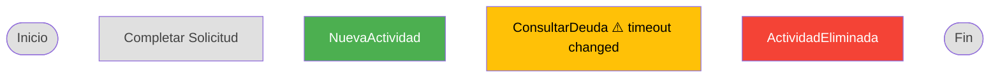

# Diff Renderer — Visual Diff para Edit

## Qué hace

Compara 2 ProcessFlowJSONs (before/after) y genera representación visual del diff: nodos coloreados por tipo de cambio + tabla de cambios en propiedades y forms.

## Cuándo se usa

Post-edit workflow. El visual-output.md orchestrador genera PFJSON(before) y PFJSON(after), luego invoca este renderer.

## Algoritmo de Diff

### Paso 1: Comparar nodos por ID

Para cada nodo en PFJSON(after):
- Si ID existe en PFJSON(before) → comparar atributos
  - Todos los atributos iguales → `unchanged`
  - Algún atributo distinto → `modified` (registrar qué cambió)
- Si ID NO existe en PFJSON(before) → `added`

Para cada nodo en PFJSON(before):
- Si ID NO existe en PFJSON(after) → `removed`

### Paso 2: Detectar renames

Si `logicalProcessId` de before == after pero `processName` cambió → es rename, no "todo borrado + todo nuevo".

Si `logicalProcessId` cambió → proceso completamente nuevo (no rename).

### Paso 3: Clasificar

| Clasificación | Condición | Color (Mermaid) | Prefijo (Texto) |
|---|---|---|---|
| added | En after, no en before | Verde (#4CAF50) | `[+]` |
| removed | En before, no en after | Rojo (#f44336) | `[-]` |
| modified | En ambos, atributos distintos | Amarillo (#FFC107) | `[~]` |
| unchanged | En ambos, idénticos | Gris (#E0E0E0) | (sin prefijo) |

### Paso 4: Generar tabla de cambios

Para nodos `modified`:
- Listar qué atributos cambiaron: `{atributo}: {valor_before} → {valor_after}`

Para cambios en propiedades (timeout, SQL, connection strings):
- Si están en la spec sección de detalle técnico, listar: "Actividad X: timeout 30s → 60s"

Para cambios en forms:
- Si form cambió: "+{N} controles, -{N} controles, bindings cambiados"
- Si form no cambió: no listar

### Paso 5: Test paths afectados

Comparar testPaths de before vs after:
- Path con nodos added/removed en su secuencia → "afectado"
- Listar: "Test paths afectados: {N} de {total}. Paths: {nombres}"

## Output — Texto Indentado

```
📊 DIFF VISUAL — {processName} v{before.version} → v{after.version}

[+] NuevaActividad (serviceTask/SQL)
[-] ActividadEliminada (userTask)
[~] ConsultarDeuda (serviceTask/SQL) — timeout 30s → 60s
    → OtraActividad (userTask) — sin cambios
    → ¿Monto > 500k? (exclusiveGateway) — sin cambios

📝 Cambios de propiedades:
  • ConsultarDeuda: timeout 30s → 60s
  • ValidarDocumentos: SQL query modificada

📋 Cambios en forms:
  • FormSolicitud: +1 control (DocumentInput)
  • FormAprobacion: binding de Monto cambiado

🔀 Test paths afectados: 2 de 7
  • Camino 3: Error — ConsultarDeuda timeout → incluye nodo modificado
  • Camino 5: Edge — NuevaActividad → incluye nodo agregado
```

## Output — Mermaid

Usa classDef de mermaid-renderer.md (added, removed, modified, unchanged):



## Edge Cases

- **Sin cambios:** "Sin cambios detectados entre v{X} y v{Y}."
- **Sin PFJSON(before):** "No hay baseline para comparar. ¿Ejecutar reverse como baseline?"
- **Solo cambios de propiedades (sin cambios estructurales):** Tabla de cambios sí, diagrama sin colores (todos unchanged)
- **Proceso renombrado (mismo logicalProcessId):** Detectar como rename, no como "todo deleted"
- **logicalProcessId cambió:** Tratar como proceso nuevo

## Gotchas

- Comparar por ID (no por nombre) — los IDs son estables, los nombres pueden cambiar
- Los nodos `removed` se muestran en el diagrama con strikethrough o indicador visual
- Si un container se movió (cambió de padre), se muestra como `modified` en la posición nueva
- El diff NO compara el BPMN — compara specs (que es lo que el usuario editó)
