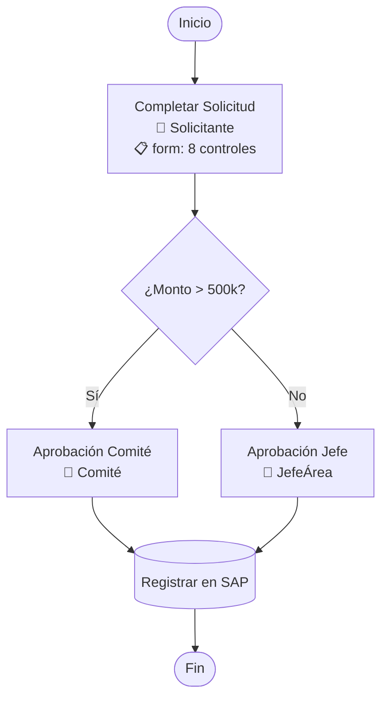

# Mermaid Renderer

## Qué hace

Convierte un ProcessFlowJSON en diagrama Mermaid flowchart. Para uso en Claude App (artifacts) o con flag `--visual mermaid`.

## Cuándo se usa

- Flag `--visual mermaid` explícito
- Claude App cuando artifacts disponibles (v2 futuro: auto-detect)

## Formato de output



## Node Shapes por tipo

| Tipo | Shape | Ejemplo |
|---|---|---|
| startEvent | `([label])` | `start_1([Inicio])` |
| endEvent | `([label])` | `end_1([Fin])` |
| userTask | `["label"]` | `ut_1["Completar Solicitud"]` |
| serviceTask | `[("label")]` | `st_1[("Registrar en SAP")]` |
| exclusiveGateway | `{"label"}` | `gw_1{"¿Monto > 500k?"}` |
| parallelGateway | `{"║ Paralelo"}` | `pg_1{"║ Paralelo"}` |
| timer | `["⏱️ label"]` | `tm_1["⏱️ Esperar 48hs"]` |
| sendMessage | `["📤 label"]` | `sm_1["📤 Notificar"]` |
| receiveMessage | `["📥 label"]` | `rm_1["📥 Esperar Respuesta"]` |
| unknown | `["⚠️ label"]` | `uk_1["⚠️ No parseada"]` |

## Labels multi-línea

Usar `<br/>` para separar:
- Línea 1: label
- Línea 2: actor (si existe): `👤 {actor}` o `👥 {actor}` (si grupo)
- Línea 3: form summary (si existe): `📋 form: {N} controles`

## Anomalías en nodos

Si el nodo tiene anomalía:
- severity error: agregar `🔴` al label
- severity warning: agregar `⚠️` al label

Ejemplo: `st_2["ConsultarDeuda ⚠️<br/>SQL sin timeout"]`

## Edges

```
{from} --> {to}                    // flow simple
{from} -->|"condición"| {to}       // gateway branch
{from} -.->|"default"| {to}       // default flow (dashed)
```

## Subgraphs (containers colapsables)

Para containers (IfElse, For, Sequence, Exception) con `collapsed: false`:

```mermaid
subgraph container_1["Rama: Monto > 500k"]
    ut_2["Aprobación Comité"]
    st_2["Verificar Documentos"]
end
```

Para containers con `collapsed: true`:

```mermaid
subgraph container_1["[+3 actividades] Rama: Monto > 500k"]
    note_1["Colapsado — usar --expand-all para ver"]
end
```

## Sanitización de nombres

**OBLIGATORIO antes de generar cualquier Mermaid.**

| Carácter | Reemplazo | Razón |
|---|---|---|
| `"` | `'` o eliminar | Rompe strings de nodo |
| `<` | `&lt;` | Interpreted as HTML |
| `>` | `&gt;` | Interpreted as HTML |
| `&` | `&amp;` | HTML entity |
| `\|` | `-` | Pipe es separator en Mermaid |
| `#` | eliminar | Comment en Mermaid |
| `;` | eliminar | Statement terminator |
| `(` `)` | eliminar o `[` `]` | Node shape chars |
| `{` `}` | eliminar o `[` `]` | Node shape chars |
| `[` `]` | eliminar | Node shape chars |
| Newlines | `<br/>` | Multi-line |
| Tildes (á,é,í,ó,ú,ñ) | **MANTENER** | UTF-8 ok en Mermaid |

**Aplicar sanitización a**: labels de nodos, labels de edges (condiciones), labels de subgraphs.

## Styling (para diff visual — Story 11.4)

Clases predefinidas para diff:

```mermaid
classDef added fill:#4CAF50,color:white,stroke:#388E3C
classDef removed fill:#f44336,color:white,stroke:#c62828
classDef modified fill:#FFC107,color:black,stroke:#F57F17
classDef unchanged fill:#E0E0E0,color:#424242,stroke:#9E9E9E
classDef active fill:#2196F3,color:white,stroke:#1565C0
classDef inactive fill:#F5F5F5,color:#BDBDBD,stroke:#E0E0E0
```

Uso: `nodeId:::added`

## Test Path Overlay (Story 13.3)

Para resaltar un test path:
1. Marcar nodos del path como `:::active`
2. Marcar nodos fuera del path como `:::inactive`
3. Título: comment `%% Test Path: {name} [{type}]`

## Validación pre-output

Antes de emitir Mermaid, verificar:
1. Todos los node IDs son válidos (alfanuméricos + underscore)
2. Todos los edges referencian nodos existentes
3. No hay IDs duplicados
4. Labels sanitizados

Si la validación falla → fallback a text-renderer + warning (NFR53).

## Gotchas

- Mermaid `graph TD` es top-down. `graph LR` es left-right. Usar TD por defecto (procesos son verticales)
- Los node IDs deben ser únicos y no pueden empezar con número → prefijar con tipo (ut_, gw_, st_, etc.)
- Mermaid tiene límite práctico de ~100 nodos antes de que el rendering se vuelva ilegible
- Subgraphs no soportan shapes — solo labels
- Las condiciones de gateway en edges deben ir entre `|"comillas"|`
- Si un label tiene `"` dentro de un `[""]` → Mermaid falla. Sanitizar SIEMPRE
